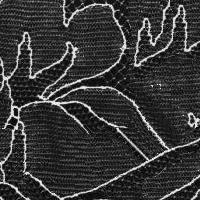

# EE4212-Computer Vision: texture-synthesis
Matlab implementation of texture synthesis with non-parametric sampling. (Efros &amp; Leung, https://www2.eecs.berkeley.edu/Research/Projects/CS/vision/papers/efros-iccv99.pdf)

Part of NUS EE4212 - Computer Vision Assignment

## Examples
#### BEFORE &emsp; &emsp; &emsp; &emsp; &emsp; &emsp; &emsp; &emsp; &emsp; &nbsp; AFTER
 &emsp; &emsp; &emsp; &emsp; &emsp; &emsp; &emsp; &emsp; &emsp;   
 &emsp; &emsp; &emsp; &emsp; &emsp; &emsp; &emsp; &emsp; &emsp;   
 &emsp; &emsp; &emsp; &emsp; &emsp; &emsp;  
 &emsp; &emsp; &emsp; &emsp; &emsp; &emsp;    
 &emsp; &emsp; &emsp; &emsp; &emsp; &emsp;  

